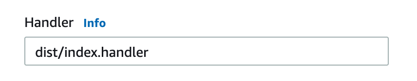

# AWS Lambda Seed

Coding AWS lambda with ESNext

## Usage

### Install dependencies

```
$ npm install
```

### Build

```
$ npm run build
```

### Publish

NOTE: You need to manually create a function on AWS Lambda with the same name for the first time, then using this command to update it.

```
$ npm run publish
```

## Troubleshooting

Q: Runtime.ImportModuleError

```
"errorType": "Runtime.ImportModuleError",
"errorMessage": "Error: Cannot find module 'index'"
```

A: Change the handler from `index.handler` to `dist/index.handler`

||
|-|

## License

[MIT](https://github.com/Amabel/aws-lambda-seed/blob/master/LICENSE)
